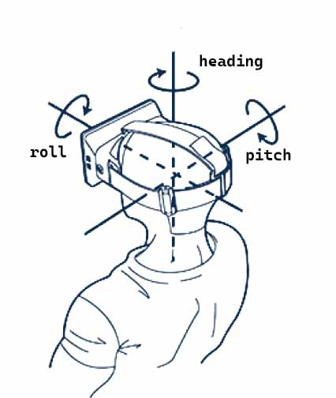

# 理解 Cesium 中的相机（1）

## 背景

基于 Cesium 的二次开发中经常会用到相机（Camera）对象, 相机对象经常用来处理和地图视角相关的功能，比如设置地图初始视角、飞行到指定位置、控制地图最小缩放高度等。虽然经常会用到，但是还没有仔细梳理过相机相关的内容，本文试着梳理一部分。

## 一、如何理解 Cesium 中的相机

生活中的相机是一个用来拍照的设备，而这里的相机应该理解成一个人机交互的媒介。地图的缩放、平移、旋转，以及相关的鼠标操作都是由相机作为媒介来实现的。相机的位置和姿态参数决定了我们能看到的地图的样子。


可以把使用 Cesium 浏览地图的过程想象成这样一个场景：

一个带有相机的能实时传回拍摄画面的无人机在地球上空飞翔。当我们在 Cesium 程序上操作鼠标的时候，无人机就会执行相关的飞行动作，并实时拍摄照片回传到程序，于是我们看到了预期的地图。在这个过程中，无人机的姿态、位置决定了相机的位置，从而决定了我们能看到什么样的地图。
## 二、调用相机功能的方式

### 1. 直接调用

可以从 Viewer 和 Scene 的实例上获取到相机实例，然后实现相关功能。

- 从 Viewer 实例上获取：`viewer.camera`。
- 从 Scene 实例上获取：`scene.camera`。

测试发现从 Viewer 和 Scene 的实例中获取到的相机对象是一样的。

Cesium 中有[相机类](https://cesium.com/learn/cesiumjs/ref-doc/Camera.html)，但是使用时一般不会去执行 `new Camera()`。

### 2. 间接调用

有些时候，不用获取相机实例也可调用相机的功能。例如`viewer.flyTo`、`viewer.zoomTo` 等。

## 三、相机的常见使用场景

### 1.设置地图视角
```js
// 设置视图为指定位置
viewer.scene.camera.setView({  
  destination: new Cesium.Cartesian3(-2081468.7298130617, 6669909.259494101, 3527719.400741791),  
  orientation: {  
    heading: 6.2643994123185305,  
    pitch: -1.565578025920228,  
    roll: 0,  
  }
});
```

### 2.飞行到指定位置或目标
```js
// 飞行到指定位置
viewer.camera.flyTo({ destination: Cesium.Cartesian3.fromDegrees(-117.16, 32.71, 15000.0), });

// 飞行到指定目标
const rectangle = viewer.entities.add({ 
  rectangle: { 
    coordinates: Cesium.Rectangle.fromDegrees(103, 25, 106, 27)
  }
}); 
viewer.flyTo(rectangle);
// 默认飞行时间 3 秒。
// 飞行完成之后，默认朝北，同时倾斜45度向下俯视。
```

### 3.缩放到指定目标
```js
// 缩放到新建的实体
const entity = viewer.entities.add({
  polyline: {
    positions: Cesium.Cartesian3.fromDegreesArray([-77, 35, -77.1, 35]),
    width: 5,
    material: Cesium.Color.RED,
  },
});
// 缩放到 entity 之后，默认朝北，同时倾斜45度向下俯视。
viewer.zoomTo(entity);
// 虽然此处没有直接使用相机对象，但是其内在原理是调整相机视角
```

### 4.追踪动态的实体
```js
const entity = viewer.entities.add({
  polyline: {
    positions: Cesium.Cartesian3.fromDegreesArray([-77, 35, -77.1, 35]),
    width: 5,
    material: Cesium.Color.RED,
  },
});
viewer.trackedEntity = wyoming;
// 当 entity 位置发生变化时，地图视角会跟着变化并保持让视角对准 entity

// 取消追踪 
viewer.trackedEntity = undefined;

// 双击实体之外的地方或者调用 viewer.zoomTo 、viewer.flyTo 时，追踪会被取消
```

关于追踪动态的实体的更详细的示例可参考[动态增长的线 - Cesium Sandcastle](https://sandcastle.cesium.com/?src=Callback%20Property.html&label=All)

### 5. 限制地球缩放高度范围
```js
// 缩放时相机位置的最小高度(以米为单位)。默认为1.0。  
viewer.scene.screenSpaceCameraController.minimumZoomDistance = 50;
// 缩放时相机位置的最大高度(以米为单位)。默认为正无穷大。  
viewer.scene.screenSpaceCameraController.maximumZoomDistance = 20000000;
```

### 6. 获取当前视角的高度(根据高度更新的渲染状态)
```js
camera.positionCartographic.height
```

### 7. 获取屏幕位置对应的球面坐标
```js
// 获取从鼠标位置到相机位置的射线
const ray = viewer.scene.camera.getPickRay(event.endPosition)

// 获取射线和球面的交点（笛卡尔坐标）
const position = viewer.scene.globe.pick(ray, viewer.scene)
```

### 8. 视角锁定在一个点
```js
// 将相机锁定在一个点
const center = Cesium.Cartesian3.fromRadians(
  2.4213211833389243,
  0.6171926869414084,
  3626.0426275055174
);
const transform = Cesium.Transforms.eastNorthUpToFixedFrame(center);
viewer.scene.camera.lookAtTransform(
  transform,
  new Cesium.HeadingPitchRange(0, -Math.PI / 8, 2900)
);
```

### 9. 绕点旋转
```js
// 将相机锁定在一个点
const center = Cesium.Cartesian3.fromRadians(
  2.4213211833389243,
  0.6171926869414084,
  3626.0426275055174
);
const transform = Cesium.Transforms.eastNorthUpToFixedFrame(center);
viewer.scene.camera.lookAtTransform(
  transform,
  new Cesium.HeadingPitchRange(0, -Math.PI / 8, 2900)
);

// 绕点旋转
viewer.clock.onTick.addEventListener(function (clock) {
  viewer.scene.camera.rotateRight(0.005);
});
```

### 10. 监听地图视图变化

```js
const camera = viewer.camera
const removeStart = camera.moveStart.addEventListener( () => {
  //todo
})
const removeEnd = camera.moveEnd.addEventListener( () => {
  //todo
})

const removeChanged = camera.changed.addEventListener(() => {
  //todo
})

// 测试发现 changed 事件不太灵敏
```
## 四、理解相机常用参数 orientation

相机由位置（position）、姿态（orientation）和视锥体（frustum）定义。<sup>[1]</sup>

相机的三个关键参数中 position、orientation 最常用，其中 orientation 不太好理解。

`orientation` 由 `heading`、`pitch`、`roll` 三个参数构成，他们的单位都是弧度。在 Camera API 中没有 `orientation` 属性，只有 `heading`、`pitch`、`roll` 三个相关的属性。这三个属性怎么理解呢？看一张图就明白了。



假设把人绑在相机上差不多就是这个效果。

三个姿态参数的含义以及取值范围如下：

**heading: 相机的偏航角**。取值范围 [`-π/2`, `π/2`]。

取值及其效果：
-  `-π/2` ：向左旋转 90 度；
- `-π/4` ：向左旋转45度；
- 0 ：不旋转；
- `π/2` ：向右旋转 90 度；
- `π/4` ：向右旋转45度；

**pitch: 相机的俯仰角**。取值范围 [`-π/2`, 0]。

取值及其效果：
 - `-π/2` ：俯视地面；
 - `-π/4` ：斜向下45度俯视地面；
 - 0 ：平视前方，将看不到地图；

**roll: 相机的翻滚角**。取值范围 [0, π]。

取值一般都是 0 。

## 参考资料

[1] . [Camera - Cesium Documentation](https://cesium.com/learn/cesiumjs/ref-doc/Camera.html)
